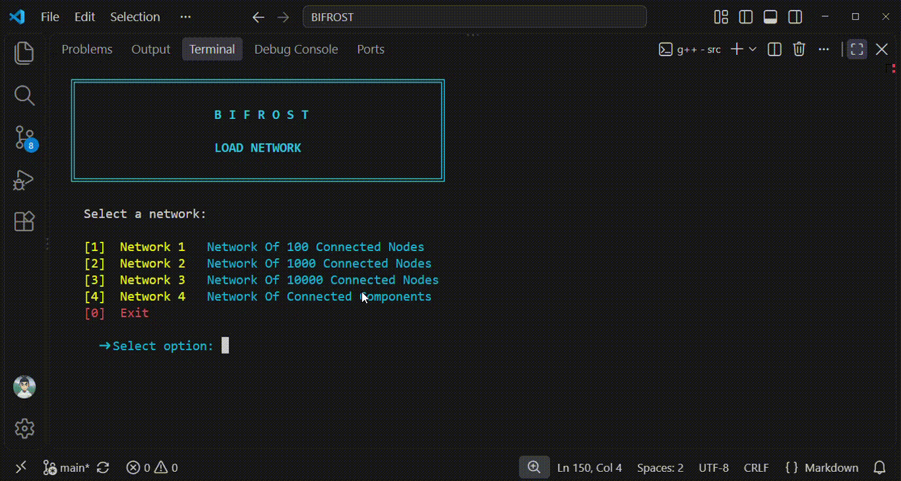
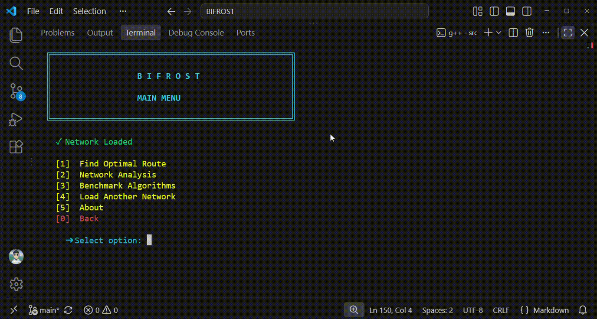

---
<div align="center">


<p>
  <b>A C++ command-line project for graph-based network analysis and optimal route finding.</b>
</p>

</div>

---

Bifrost is a C++ command-line project that models real-world locations as an interconnected network and uses graph algorithms to explore and navigate it.

The project focuses on solving route and network analysis problems such as finding an optimal path between two locations based on **distance, time, or cost**. The same system could be extended into applications such as a **train navigation system**, where stations become nodes and railway connections become weighted edges.

---

# Features

- **Network Analysis**
- **BFS & DFS Traversal**
- **Dijkstra & A\* Pathfinding**
- **Distance, Time & Cost Optimization**
- **Route Analysis**
- **Algorithm Benchmarking**

---

# Features in Action

## Route Finder

<p align="center">
  
</p>

The Route Finder allows the user to select a source and destination, choose what to optimize, and select either Dijkstra or A\*. Bifrost then calculates and displays the optimal route between the two locations.

---

## Network Analysis

<p align="center">
  
</p>

Network Analysis provides information about the loaded network and allows the user to explore it using BFS and DFS. It also checks connectivity and identifies connected components.

---

## Algorithm Benchmarking

<p align="center">
  
</p>

Bifrost runs multiple route queries and repeats each query several times to compare Dijkstra and A\*. The benchmark measures **execution time** and **nodes explored**, then calculates the relative speedup.

For example, the benchmark can show that A\* explores fewer nodes than Dijkstra for the same route while also comparing their execution times.

---

# Algorithms

| Algorithm | Purpose | Time Complexity |
|:---|:---|---:|
| **BFS** | Network traversal | `O(V + E)` |
| **DFS** | Network traversal | `O(V + E)` |
| **Connected Components** | Find connected groups | `O(V + E)` |
| **Dijkstra** | Optimal weighted path | `O((V + E) log V)` |
| **A\*** | Heuristic-based optimal path | `O((V + E) log V)`* |

> **Note:** A\* performance depends heavily on the quality of its heuristic.

---

# Project Structure

```text
Bifrost/
│
├── main.cpp
├── Graph.cpp
├── Graph.h
├── build.bat
│
├── data/
│   ├── network_01.txt
│   ├── network_02.txt
│   ├── network_03.txt
│   └── ...
│
├── assets/
│   ├── logo.png
│   ├── Demo-RouteFinder.gif
│   ├── Demo-NetworkAnalysis.gif
│   └── Demo-Benchmark.gif
│
└── README.md
```

- **`main.cpp`** — Handles the CLI, menus, user input, and displaying results.
- **`Graph.h`** — Defines the graph class, data structures, and public function declarations.
- **`Graph.cpp`** — Implements network loading, graph algorithms, route analysis, and benchmarking.
- **`build.bat`** — Compiles and runs the project using `g++`.

---

# Getting Started

Bifrost is designed to run from **Visual Studio's Terminal** on Windows. The terminal is recommended because the interface uses Unicode and ASCII characters for its visual layout.

### Build & Run

Open the project in Visual Studio, open its terminal, and run:

```bat
build.bat
```

Or compile manually:

```bat
g++ main.cpp Graph.cpp -o bifrost
.\bifrost.exe
```

---

# Tech Stack

- **C++**
- **C++ STL**

---

# Project Status

**Completed**

Through Bifrost, I learned:

- How to design and work with weighted graph structures.
- How BFS, DFS, Dijkstra, and A\* work in a practical system.
- How to reconstruct and analyze paths after running graph algorithms.
- How to benchmark algorithms and compare their performance.

---